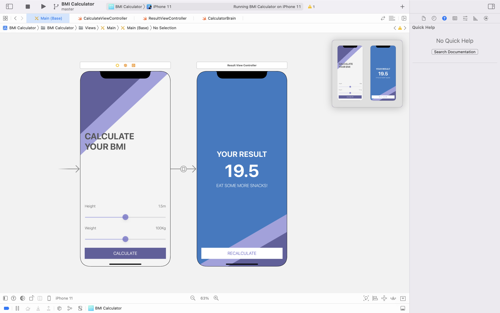

# The App: BMI Calculator

By the end of the module, you will have made a Body Mass Index calculator. Based on the user’s weight and height it will calculate their body mass and give a piece of health advice depending on whether if they have eaten too many pies or if they need to eat more pies. 

## What I learnt

* How to create multi-screen apps with animated navigation.
* Optional binding, optional chaining and the nil coalescing operator.
* How to create classes and difference between classes and structs. 
* Pass by value vs. pass by reference. 
* Formatting Strings. 
* Color literals.

## What I did: The Code
The forked code defaults with two ViewController views already created in the Main.storyboard file. The first screen is where the user, using
the UISlider selects their height(in metres) and weight(in Kilograms). A reference to all the UI Components was created in the CalculateViewController 
file. 



The app was refactored to follow the MVC Design pattern where the Model (CalculatorBrain struct and the BMI struct) is separated from the View
and the ViewController. Using the Cocoa Touch class, a new ResultViewController was created and linked to the second screen which displays the result of the User's BMI, a healthy advice and the background color to go with the result type (underweight, normal weight or overweight).

The Model:

```swift

//BMI struct
struct BMI {
    let value: Float
    let advice: String
    let color: UIColor
}

//CalculatorBrain struct
struct CalculatorBrain {
    var height: Float = 0.0
    var weight: Float = 0.0
    var bmi: BMI?
    
    mutating func setHeight(userHeight: Float) {
        height = userHeight
    }
    
    mutating func setWeight(userWeight: Float) {
        weight = userWeight
    }
    
    mutating func calculateBMI() {
        let bmiValue = weight / (height * height)
        
        let underWeightColor = #colorLiteral(red: 0.4745098054, green: 0.8392156959, blue: 0.9764705896, alpha: 1)
        let normalWeightColor = #colorLiteral(red: 0.721568644, green: 0.8862745166, blue: 0.5921568871, alpha: 1)
        let overWeightColor = #colorLiteral(red: 0.9098039269, green: 0.4784313738, blue: 0.6431372762, alpha: 1)
        
        if (bmiValue < 18.5) {
            bmi = BMI(value: bmiValue, advice: "Eat more pies!", color: underWeightColor)
        } else if (bmiValue < 24.9 ){
            bmi = BMI(value: bmiValue, advice: "Fit as a fiddle!", color: normalWeightColor)
        } else {
            bmi = BMI(value: bmiValue, advice: "Eat less pies!", color: overWeightColor)
        }
    }
    
    func getBmi() -> BMI? {
        return bmi
    }
    
    func getHeight() -> String {
        return String(format: "%.2f", height)
    }
    
    func getWeight() -> String {
        return String(format: "%.0f", weight)
    }
}
```

The Controllers:

```swift
class CalculateViewController: UIViewController {

    @IBOutlet weak var heightLabel: UILabel!
    @IBOutlet weak var weightLabel: UILabel!
    @IBOutlet weak var heightSlider: UISlider!
    @IBOutlet weak var weightSlider: UISlider!
    
    var calculatorBrain = CalculatorBrain()
    
    
    override func viewDidLoad() {
        super.viewDidLoad()
        // Do any additional setup after loading the view.
    }

    @IBAction func heightSliderChanged(_ sender: UISlider) {
        calculatorBrain.setHeight(userHeight: sender.value)
        heightLabel.text = "\(calculatorBrain.getHeight())m"
    }

    @IBAction func weightSliderChange(_ sender: UISlider) {
        calculatorBrain.setWeight(userWeight: sender.value)
        weightLabel.text = "\(calculatorBrain.getWeight())kg"
    }
    
    
    @IBAction func calculatePressed(_ sender: UIButton) {
        calculatorBrain.calculateBMI()
        self.performSegue(withIdentifier: "goToResult", sender: self)
    }
    
    override func prepare(for segue: UIStoryboardSegue, sender: Any?) {
        if (segue.identifier == "goToResult") {
            let destinationVC = segue.destination as! ResultViewController
            destinationVC.bmiValue = String(format: "%.1f", calculatorBrain.getBmi()!.value)
            destinationVC.advice = calculatorBrain.getBmi()?.advice
            destinationVC.tintColor = calculatorBrain.getBmi()?.color
        }
    }
}
```
</br>

```swift
class ResultViewController: UIViewController {

    var bmiValue: String?
    var advice: String?
    var tintColor: UIColor?
    
    
    @IBOutlet weak var bmiLabel: UILabel!
    @IBOutlet weak var adviceLabel: UILabel!
    @IBOutlet var backGroundView: UIView!
    
    override func viewDidLoad() {
        super.viewDidLoad()
        
        bmiLabel.text = bmiValue
        adviceLabel.text = advice
        backGroundView.backgroundColor = tintColor
    }
    
    @IBAction func recalculatePressed(_ sender: UIButton) {
        self.dismiss(animated: true, completion: nil)
    }

}
```

https://user-images.githubusercontent.com/34939672/227218790-3cbed1ea-ac6b-4938-8bef-273f230d5ee0.mov


</br></br>
>This is a companion project to The App Brewery's Complete App Development Bootcamp, check out the full course at [www.appbrewery.co](https://www.appbrewery.co/)


